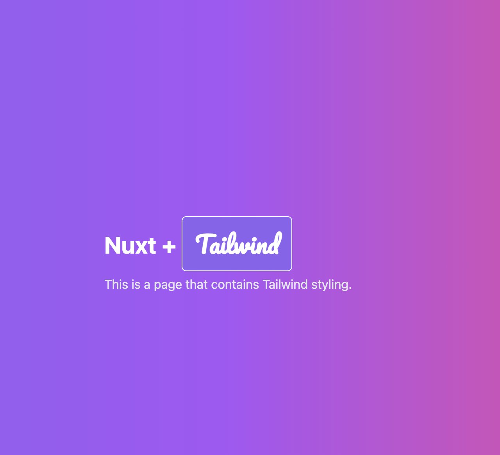

# Formkit Example

Example of using Tailwind with Nuxt3.

In this example we also added the following:

1. Custom color theme `biloba-flower`
1. Google font `Roboto`

## References

- https://uicolors.app/create
- https://tailwindcss.nuxtjs.org/
- https://google-fonts.nuxtjs.org/

## Setup

`yarn`

`yarn dev`

Open http://localhost:3000
